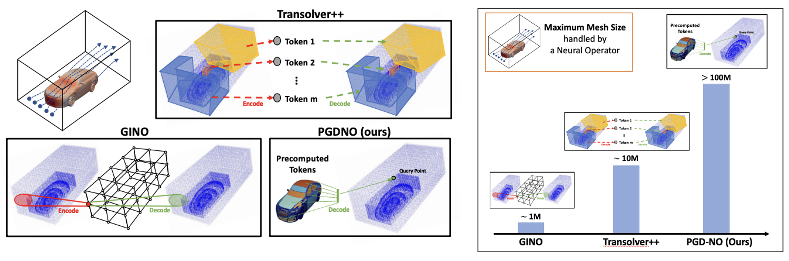

# PGD-NO
**Official Implementation of Precomputed Geometry Decomposition Neural Operator**

[ICML 2026] PGD-NO: A Neural Operator with Precomputed Geometry Decomposition for 3D Million-Scale physics simulations



## Environment Setup

Run the setup script to create a conda environment and install all required dependencies:

```bash
./setup_env.sh
```

## Data Processing

**Step 1:** Download the raw data from the following sources:
- [Heat Sink](https://dataverse.harvard.edu/dataverse/FC4NO)
- [JEB](https://dataverse.harvard.edu/dataset.xhtml?persistentId=doi:10.7910/DVN/XFUWJG)
- [DrivAerNet++](https://dataverse.harvard.edu/dataverse/DrivAerNet)
- [Aircraft](https://github.com/thuml/Transolver_plus)

**Step 2:** Run the processing script in each dataset folder to prepare the data:

```bash
python process_data.py
```

## Model Training

Train the model using the main script:

```bash
python main.py
```

## Acknowledgments

We gratefully acknowledge the contributions of all open-source datasets and model architectures used in this project.

## Notes

1. Code for CFD volume data training will be made publicly available upon publication, subject to proper request procedures.
2. Experiment results are stored in slurms.
